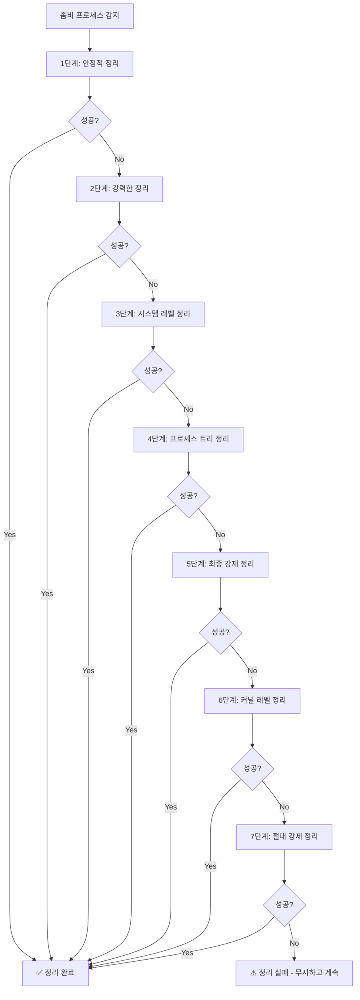

# 🧟 Rocky Linux Zombie Process Monitor

<div align="center">


**🚀 실시간 좀비 프로세스 모니터링 및 자동 정리 시스템**

*Rocky Linux 8/9에서 좀비 프로세스를 실시간으로 모니터링하고 자동으로 정리하는 최적화된 시스템*

[](https://github.com/xowk9876/zombie-monitor)
[](https://github.com/xowk9876/zombie-monitor)

</div>

---

## 📋 목차

- [✨ 주요 기능](#-주요-기능)
- [🚀 Quick Start](#-quick-start)
- [📋 사용법](#-사용법)
- [🔧 자동화 설정](#-자동화-설정)
- [📈 모니터링 및 로깅](#-모니터링-및-로깅)
- [🗑️ 완전 제거](#️-완전-제거)
- [🛠️ 문제 해결](#️-문제-해결)
- [📁 파일 구조](#-파일-구조)
- [📄 라이선스](#-라이선스)
- [🆘 지원](#-지원)


## 🚀 Quick Start

### 📋 사전 준비 (Rocky Linux 8/9)

```bash
# 1️⃣ 필수 패키지 설치
sudo yum update -y
sudo yum install -y git dos2unix

# 2️⃣ 저장소 클론
git clone https://github.com/xowk9876/zombie-monitor.git
cd zombie-monitor

# 3️⃣ 파일 권한 설정
sudo chmod +x *.sh
sudo chown root:root *.sh *.conf

# 4️⃣ CRLF 문제 해결 (필요시)
dos2unix *.sh *.conf
```

### 📥 설치 및 실행

```bash
# 1️⃣ 설치
sudo ./setup_zombie_monitor.sh

# 2️⃣ 실시간 모니터링 시작
sudo /opt/zombie_monitor/zombie_monitor.sh

# 3️⃣ 제거 (필요시)
sudo ./uninstall_zombie_monitor.sh
```

### ⚡ 빠른 테스트

```bash
# 좀비 프로세스 생성 (테스트용)
./create_test_zombies.sh

# 모니터링 실행
sudo /opt/zombie_monitor/zombie_monitor.sh

# [M] 키로 수동 정리 테스트
# [A] 키로 자동 정리 활성화
```

## ✨ 주요 기능

<table>
<tr>
<td width="50%">

### 🎯 실시간 모니터링
- ⚡ **2초 간격 자동 새로고침**
- 🎨 **시각적 상태 표시** (정상/주의/위험)
- 💻 **시스템 정보** (로드 평균, 메모리 사용률)
- 📋 **상세 정보** (PID, PPID, 명령어)
- ⌨️ **안정적인 키 입력**
- 🔧 **터미널 설정 자동 복원**
- 📊 **실시간 통계 화면**

</td>
<td width="50%">

### 🤖 자동 정리
- 🚀 **감지 즉시 정리**
- 🔥 **7단계 정리 과정**
- 🛡️ **시스템 레벨 좀비 처리**
- 🧠 **스마트 정리** (단계별 자동 진행)
- ⚡ **즉시 반응**
- 🔄 **자동 재시도**

</td>
</tr>
<tr>
<td width="50%">

### 📊 통계 및 로깅
- 📈 **정확한 세션 통계**
- 🔢 **실시간 성공률 계산**
- 📝 **상세 로깅**
- 🔄 **로그 로테이션** (7일간 보관)
- 📊 **실시간 통계 화면**
- 📋 **상세 정보** (PID, PPID, 명령어)

</td>
<td width="50%">

### 🎮 인터랙티브 제어
- ⌨️ **단축키 지원** ([A][M][S][Q][H])
- 🎯 **논블로킹 키 입력**
- ❓ **도움말 시스템**
- 📊 **실시간 통계**
- 🛡️ **터미널 안전성**
- 🔧 **터미널 설정 자동 복원**

</td>
</tr>
</table>

### 🔥 7단계 정리 과정



## 📋 사용법

### 기본 사용법

```bash
# 실시간 모니터링 (기본 모드, 2초 간격)
sudo /opt/zombie_monitor/zombie_monitor.sh

# 수동 모드 (자동 정리 비활성화)
sudo /opt/zombie_monitor/zombie_monitor.sh -m

# 5초 간격으로 모니터링
sudo /opt/zombie_monitor/zombie_monitor.sh -i 5

# 상세 출력 모드
sudo /opt/zombie_monitor/zombie_monitor.sh -v

# 도움말 표시
sudo /opt/zombie_monitor/zombie_monitor.sh -h
```

### 고급 옵션

```bash
# 백그라운드에서 실행
nohup sudo /opt/zombie_monitor/zombie_monitor.sh > /dev/null 2>&1 &

# 서비스로 실행
sudo systemctl start zombie-monitor

# 서비스 상태 확인
sudo systemctl status zombie-monitor

# 서비스 중지
sudo systemctl stop zombie-monitor

# 서비스 재시작
sudo systemctl restart zombie-monitor
```

### 🎮 실시간 모니터링 단축키

| 단축키 | 기능 | 설명 |
|--------|------|------|
| **[A]** | 자동 정리 토글 | 활성화/비활성화 전환 |
| **[M]** | 수동 정리 실행 | 7단계 정리 과정 실행 |
| **[S]** | 통계 정보 표시 | 세션 통계 + 최근 로그 |
| **[Q]** | 모니터링 종료 | 안전한 종료 |
| **[H]** | 도움말 표시 | 내장 도움말 |
| **Ctrl+C** | 강제 종료 | 터미널 설정 자동 복원 |

### 📊 실시간 모니터링 화면 예시

```
╔══════════════════════════════════════════════════════════════╗
║                🧟 ZOMBIE PROCESS MONITOR                    ║
║                    실시간 모니터링                          ║
╚══════════════════════════════════════════════════════════════╝

💡 단축키: [A]자동정리 [M]수동정리 [S]통계 [Q]종료 [H]도움말

📊 현재 상태 (2025-09-27 18:42:31)
━━━━━━━━━━━━━━━━━━━━━━━━━━━━━━━━━━━━━━━━━━━━━━━━━━━━━━━━━━━━━━━━━━
✅ Zombie 프로세스: 0개 (정상)
💻 시스템 정보:
  로드 평균: 0.27
  메모리 사용률: 4.8%

⚙️  설정:
  자동 정리: 활성화
  새로고침 간격: 2초
  경고 임계값: 5개

📈 세션 통계:
  감지된 좀비: 5개
  정리된 좀비: 3개
  정리 성공률: 60%
  세션 시작: 2025-09-27 18:40:30

━━━━━━━━━━━━━━━━━━━━━━━━━━━━━━━━━━━━━━━━━━━━━━━━━━━━━━━━━━━━━━━━━━
실시간 모니터링 중... (2초마다 새로고침)
```

## 🔧 자동화 설정

### 크론잡 설정
```bash
# 5분마다 실행
*/5 * * * * /opt/zombie_monitor/zombie_monitor.sh

# 매일 새벽 2시에 정리
0 2 * * * /opt/zombie_monitor/zombie_monitor.sh -v
```

### Systemd 서비스
```bash
# 서비스 상태 확인
sudo systemctl status zombie-monitor

# 서비스 시작/중지
sudo systemctl start zombie-monitor
sudo systemctl stop zombie-monitor

# 서비스 재시작
sudo systemctl restart zombie-monitor

# 서비스 활성화/비활성화
sudo systemctl enable zombie-monitor
sudo systemctl disable zombie-monitor
```

> **⚠️ 주의**: 서비스는 자동 시작되지 않습니다. 수동으로 시작하세요:
> ```bash
> sudo systemctl start zombie-monitor
> ```

## 📈 모니터링 및 로깅

### 로그 파일
```bash
# 실시간 로그 모니터링
tail -f /var/log/zombie_monitor.log

# 특정 시간대 로그 확인
grep "2025-09-27 14:" /var/log/zombie_monitor.log

# 에러 로그 확인
grep -i "error" /var/log/zombie_monitor.log
```

### 로그 분석
```bash
# 좀비 프로세스 관련 로그만 필터링
grep "Zombie" /var/log/zombie_monitor.log

# 정리 성공 로그 확인
grep "SUCCESS" /var/log/zombie_monitor.log

# 에러 로그 확인
grep "ERROR" /var/log/zombie_monitor.log

# 7단계 정리 과정 로그 확인
grep "단계" /var/log/zombie_monitor.log
```

## 🗑️ 완전 제거

설치된 zombie monitor 시스템을 완전히 제거하려면:

```bash
# 확인 후 제거 (권장)
sudo ./uninstall_zombie_monitor.sh

# 강제 제거 (확인 없이)
sudo ./uninstall_zombie_monitor.sh -f

# 제거 확인
ls -la /opt/ | grep zombie
systemctl status zombie-monitor

# 언인스톨 도움말
sudo ./uninstall_zombie_monitor.sh -h
```

### 제거되는 항목
- **📁 스크립트 파일**: `/opt/zombie_monitor/`
- **📄 설정 파일**: `/etc/zombie_monitor.conf`
- **📄 로그 파일**: `/var/log/zombie_monitor.log`
- **⚙️ 크론잡 설정**: 모든 zombie 관련 크론잡
- **⚙️ systemd 서비스**: `zombie-monitor.service`
- **⚙️ 로그 로테이션 설정**: `/etc/logrotate.d/zombie-monitor`
- **🔒 락 파일**: `/tmp/zombie_monitor.lock`

## 🛠️ 문제 해결

### 일반적인 문제

#### 1. CRLF 문제
```bash
# 오류: $'\r': command not found
# 해결: dos2unix 설치 및 변환
sudo yum install dos2unix
dos2unix *.sh *.conf

# 또는 sed 명령어 사용
sed -i 's/\r$//' *.sh *.conf
```

#### 2. 권한 오류
```bash
# 스크립트 실행 권한 확인
ls -la zombie_monitor.sh

# 권한 수정
sudo chmod +x zombie_monitor.sh
sudo chown root:root zombie_monitor.sh
```

#### 3. 설정 파일 문제
```bash
# 설정 파일 확인
cat /etc/zombie_monitor.conf

# 설정 파일 권한 수정
sudo chmod 644 /etc/zombie_monitor.conf
sudo chown root:root /etc/zombie_monitor.conf
```

#### 4. 실시간 모니터링 문제
```bash
# 모니터링 스크립트 실행 권한 확인
chmod +x zombie_monitor.sh

# 모니터링 스크립트 테스트
./zombie_monitor.sh -h

# 로그 파일 확인
tail -f /var/log/zombie_monitor.log
```

#### 5. 좀비 프로세스 정리 실패 문제
```bash
# PPID 0.0인 시스템 레벨 좀비 확인
ps aux | awk '$8 ~ /^Z/ { print $2, $3, $11 }'

# 7단계 정리 시스템으로 수동 정리
sudo /opt/zombie_monitor/zombie_monitor.sh
# [M] 키를 눌러 수동 정리 실행

# 부모 프로세스 강제 종료 (위험)
sudo kill -9 [부모_PID]

# 시스템 재부팅 (최후의 수단)
sudo reboot
```

#### 6. 로그 파일 문제
```bash
# 로그 파일 권한 확인
ls -la /var/log/zombie_*.log

# 로그 파일 권한 수정
sudo chmod 644 /var/log/zombie_*.log
sudo chown root:root /var/log/zombie_*.log

# 로그 디렉토리 확인
sudo mkdir -p /var/log
```

### 디버깅 명령어

```bash
# 상세 로그 확인
tail -f /var/log/zombie_monitor.log

# 시스템 로그 확인
journalctl -u zombie-monitor -f

# 프로세스 상태 확인
ps aux | grep zombie

# 서비스 상태 확인
systemctl status zombie-monitor

```

## 📁 파일 구조

```
zombie-monitor/
├── 📄 README.md                   # 📖 프로젝트 문서
├── 🧟 zombie_monitor.sh           # 실시간 모니터링 스크립트
├── ⚙️ zombie_monitor.conf         # 설정 파일
├── 🚀 setup_zombie_monitor.sh     # 설치 스크립트
└── 🗑️ uninstall_zombie_monitor.sh # 제거 스크립트
```

### 📋 각 파일의 역할

| 파일 | 역할 | 설명 |
|------|------|------|
| **`zombie_monitor.sh`** | 🧟 메인 스크립트 | 7단계 정리 시스템을 갖춘 실시간 좀비 프로세스 모니터링 |
| **`zombie_monitor.conf`** | ⚙️ 설정 파일 | 모니터링 설정 (CRLF 문제 해결) |
| **`setup_zombie_monitor.sh`** | 🚀 설치 스크립트 | 시스템에 자동 설치 및 설정 (자동 시작 비활성화) |
| **`uninstall_zombie_monitor.sh`** | 🗑️ 제거 스크립트 | 타임아웃 기능이 있는 완전 제거 스크립트 |
| **`README.md`** | 📖 문서 | 최적화된 기능 설명, 사용법, 문제 해결 가이드 |

## 📄 라이선스

이 프로젝트는 MIT 라이선스 하에 배포됩니다.

## 🆘 지원

<div align="center">

### 📧 연락처

| 플랫폼 | 링크 | 설명 |
|--------|------|------|
| 📧 **이메일** | [bhd03014@gmail.com](mailto:bhd03014@gmail.com) | 기술 지원 및 문의 |
| 📸 **인스타그램** | [@tae_system](https://www.instagram.com/tae_system/) | 프로젝트 소식 |
| 🐙 **GitHub** | [@xowk9876](https://github.com/xowk9876) | 소스 코드 및 이슈 |

</div>

---

<div align="center">

**👨‍💻 작성자**: Tae-system  
**📦 버전**: 1.0 (최적화 완료)  
**📅 최종 업데이트**: 2025-09-27

---

### ⭐ 이 프로젝트가 도움이 되었다면 Star를 눌러주세요!

[](https://github.com/xowk9876/zombie-monitor)
[](https://github.com/xowk9876/zombie-monitor)

</div>

